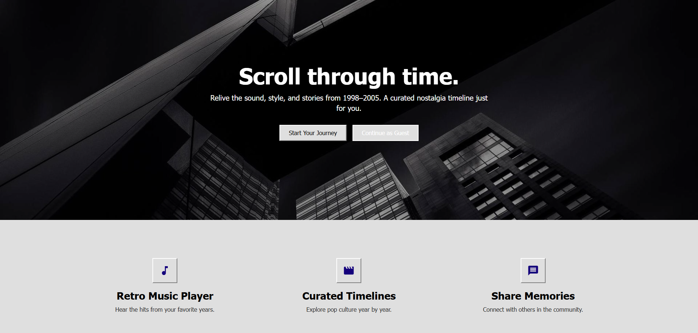
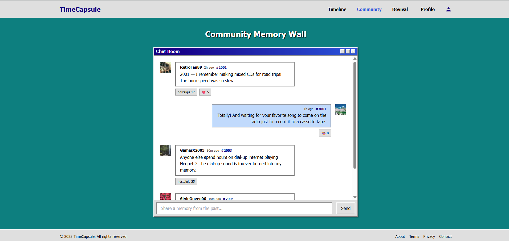
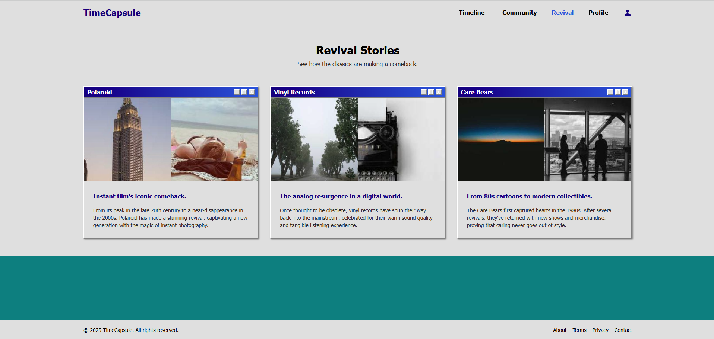
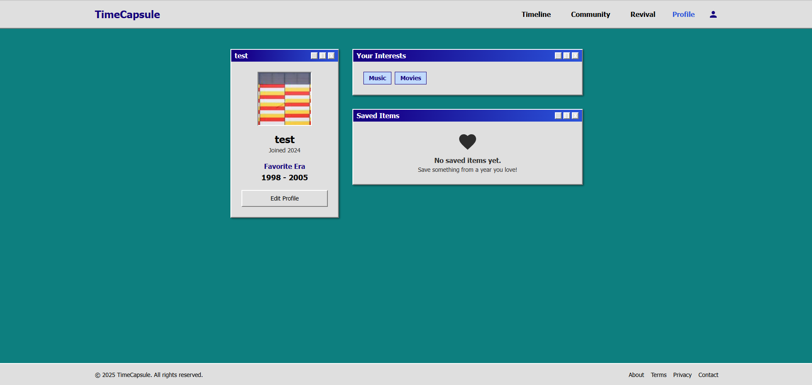

# 🏆 TimeCapsule: Curated Timelines of Nostalgia

> **🎉 Hackathon Winner!** This project, **TimeCapsule**, secured **The Best Idea** at the 6th Pitch and Prototype Hackathon organized by the UoB Computer Science Society!

> A journey back in time to the most memorable moments of the late 90s and early 2000s. TimeCapsule is a web application that generates curated timelines of pop culture, powered by Google's Gemini AI.

## ✨ Features

- **Dynamic Timelines**: Generates a unique timeline for any year between 1998 and 2005, complete with top songs, movies, fashion trends, and world events.
- **AI-Generated Content**: Leverages the Gemini API to create descriptive taglines and unique image prompts for each year.
- **Nostalgic UI**: A retro-themed interface inspired by classic operating systems to immerse you in the era.
- **Community Forum**: Share memories and discuss your favorite moments with other users.
- **Revival Stories**: Discover stories of brands and trends that have made a comeback.
- **Integrated Music Player**: Listen to iconic tracks from the past while you browse.

## 🛠️ Tech Stack


## 🚀 Getting Started

Follow these instructions to get the project up and running on your local machine.

### Prerequisites

- [Node.js](https://nodejs.org/en/) (v18 or later recommended)
- An API key from [Google AI Studio](https://aistudio.google.com/)

### Installation

1.  **Clone the repository:**
```sh
git clone https://github.com/manasyesuarthana/TimeCapsule
cd TimeCapsule
```

2.  **Install dependencies:**
```sh
npm install
```

3.  **Set up your environment variables:**
Create a file named `.env.local` in the root of the project and add your Google Gemini API key:
```
GEMINI_API_KEY=YOUR_API_KEY_HERE
```

4.  **Run the development server:**
```sh
npm run dev
```
    
Open [http://localhost:3000](http://localhost:3000) in your browser to see the application.

## 📂 Project Structure

The project is organized into several key directories:

```

.
├─── src/
│    ├─── components/   # Reusable UI components (Button, Card, etc.)
│    ├─── context/      # React Context for global state management
│    ├─── pages/        # Main pages of the application (Timeline, Community, etc.)
│    ├─── services/     # Service for interacting with the Gemini API
│    ├─── App.tsx       # Main application component and router
│    └─── types.ts      # TypeScript type definitions
├─── .env.local         # Environment variables (ignored by Git)
├─── index.html         # HTML entry point
└─── package.json       # Project dependencies and scripts

```

## 🖼️ Screenshots

<div align="center">
  
  <p><em>The homepage of the app.</em></p>
</div>

<br>

<div align="center">
  
  <p><em>The community forum where users share memories.</em></p>
</div>

<br>

<div align="center">
  
  <p><em>The Revivals page where users can see which past trends are coming back to modern times.</em></p>
</div>

<br>

<div align="center">
  
  <p><em>A dedicated profile page where users can manage their preferences and activities.</em></p>
</div>

---

## 👥 Contributors & Acknowledgement

We are grateful for the hard work and dedication of the team that brought this project to life.

| Name | GitHub Profile |
| :--- | :--- |
| **I Putu Herjuna Manasye Suarthana** | [github.com/manasyesuarthana](https://github.com/manasyesuarthana) |
| **Bambang Abhinawa Pinakasakti** | [github.com/abhinawap](https://github.com/abhinawap) |
| **Abi Prasetya** | [github.com/abiprasetya](https://github.com/abiprasetya) |

*This project was bootstrapped from Google's AI Studio.*
*This project was our group's submission for the 6th Pitch and Prototype Hackathon organized by the UoB Computer Science Society.*
